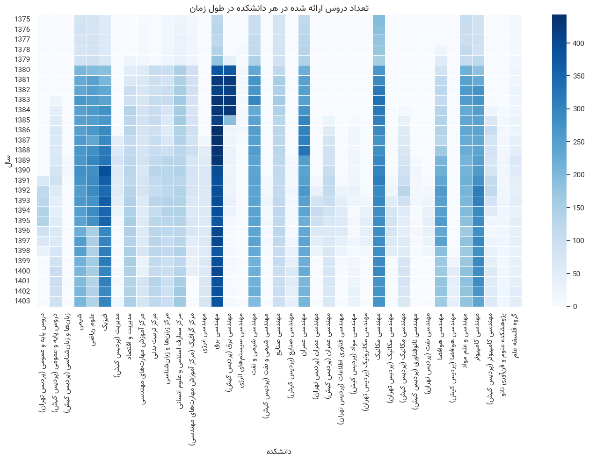

# SUT Course History Analysis

Analysis of historical course data from Sharif University of Technology (SUT), including:
- Course offerings over time
- Enrollment trends
- Professors’ teaching activity

## Repository Structure

- `data/`      : Raw and processed course datasets.
- `notebooks/` : Jupyter notebooks for cleaning, EDA, and forecasting.
- `docs/`      : HTML exports of notebooks.

## Example Figure

**Figure:** Number of courses offered per department, displayed as a heatmap over the years.

## Work in Progress

This project is still under development. More analysis, figures, and documentation will be added over time.  

Feedback, suggestions, and contributions are very welcome!

## License
MIT License